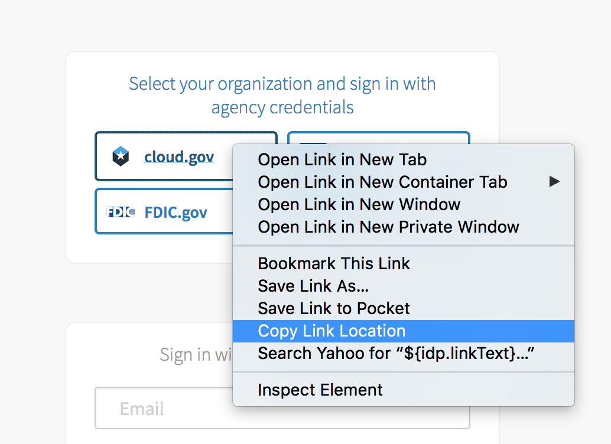

# UAA Extras [](https://codeclimate.com/github/18F/cg-uaa-extras)

This application recreates the invite functionality that previously existed in UAA by using the /invite_users API endpoint.

### Installing the App

#### Step One: Determine the URL for your instance of UAA Extras

You'll need to know where the app is going to be hosted, so you can tell UAA about it in the next step.

For example, if you'll be deploying into Cloudfoundry on BOSH-lite your url would probably be http://invite.bosh-lite.com/

#### Step Two: Create a client in UAA for this app

This application uses oauth to perform actions on your behalf in UAA.  To add a new oauth client in UAA, run the following command:

	uaac client add [your-client-id] --name "UAA Extras" --scope "scim.invite,password.write" --authorized_grant_types "authorization_code" --redirect_uri [url-from-step-one]/oauth/login -s [your-client-secret]

Remember the client-id and client-secret, you'll need them in the next step

#### Step Three: Configure the app

The configuration is entirely read from environment variables. Edit the manifest.yml files and update your settings as neccessary

#### Step Four: Ensure your UAA user has the proper scopes/groups

Your UAA user must have the scim.invite scopes/group membership

	uaac member add scim.invite [your-uaa-login]

#### Step Five: Launch the app

This app was designed to run in Cloud Foundry:

	cf push

You can also run it locally in debug mode:

	# set configuration env vars as needed
	./debug.py

### Configuring UAA Invites to leverage cloud.gov IdP

Because of the redirect that occurs for setting up cloud.gov multi-factor
authentication, the `IDP_PROVIDER_URL` must match what is coming from the UAA
login screen under `cloud.gov`.



#### A bit on the `/first-login` route

The `/first-login` route is used to redirect users with an origin of `cloud.gov`
to the cloud.gov IdP provider. This route is used to set the user's origin to
`cloud.gov` and the `externalId` to their `userName`. On a successful update of
the user, `cg-uaa-extras` will redirect to the `IDP_PROVIDER_URL` to complete
the user's authentication and TOTP token creation. This is why the URL from the
screenshot above is necessary for the `IDP_PROVIDER_URL`.

### Development

This project uses a `setup.py` to install dependencies. Run the following
command to get started with development.

```shell
python3 ./setup.py install
```

To get a local server up, run the following command. Make sure you
properly setup the environment variables mentioned above in the
documentation.

```shell
python3 ./run.py
```

#### Running tests

Tests are run using `tox` and `flake8`.

```shell
pip install tox
```

To run the tests, simply run `tox` from the root of the repository.
